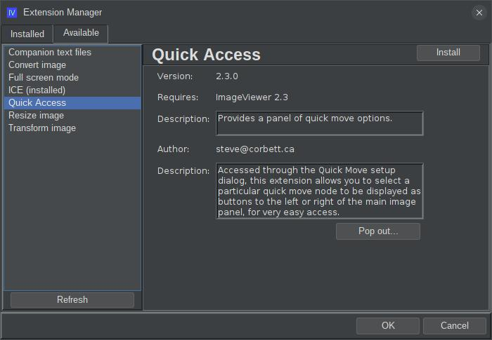

# ext-iv-quick-access

## What is this?

This is an extension for the [ImageViewer](https://github.com/scorbo2/imageviewer) application to provide quick 
access to frequently used directories. This allows you
to bypass the popup menu and just click a button in a conveniently located quick-access panel to sort the
current image to a given directory.

## How do I get it?

### Option 1: automatic download and install:

**New!** Starting with the 2.3 release of ImageViewer, you no longer need to manually build and install application extensions!
Now, you can visit the "Available" tab of the new and improved extension manager dialog to find them:



Select "Quick Access" from the menu on the left and hit the "Install" button in the top right. If you decide later
to remove the extension, come back to the extension manager dialog, select "Quick Access" from the menu on the
left, and hit the "Uninstall" button in the top right. The application will prompt to restart. It's just that easy!

### Option 2: manual download and install:

You can manually download the extension jar: 
[ext-iv-quick-access-2.3.0.jar](http://www.corbett.ca/apps/ImageViewer/extensions/2.3/ext-iv-quick-access-2.3.0.jar)

Save it to your ~/.ImageViewer/extensions directory and restart the application.

### Option 3: build from source

You can clone this repo and build the extension jar with Maven (Java 17 or higher required):

```shell
git clone https://github.com/scorbo2/ext-iv-quick-access.git
cd ext-iv-quick-access
maven package

# Copy the result to extensions directory:
cp target/ext-iv-quick-access-2.3.0.jar ~/.ImageViewer/extensions/
```

## Okay, it's installed, now how do I use it?

After ImageViewer restarts, you should find a "Quick Access" button on the Quick Move
Destinations configuration dialog:


You can add directories here, recursively if needed, and even rename them for labelling purposes.
The Quick Access panel will show up by default on the left side of the main image panel (you can configure
the location of the Quick Access panel in application settings):


Now, instead of going through the menus, you can simply click one of the destination buttons, and the
current image will be sorted into that destination directory.

Click "Remove group" on any of the destination groupings to remove it from the Quick Access panel.
You can easily get it back by revisiting the Quick Access Destinations configuration dialog. 

Note that the hierarchy of destinations presented on the Quick Access panel doesn't have to match the
hierarchy of directories on the file system! Using the Quick Access Destinations configuration dialog,
you can create whatever hierarchy makes sense, regardless of how the file system is laid out.

## Requirements

ImageViewer 2.3 or higher.

## License

Imageviewer and this extension are made available under the MIT license: https://opensource.org/license/mit
